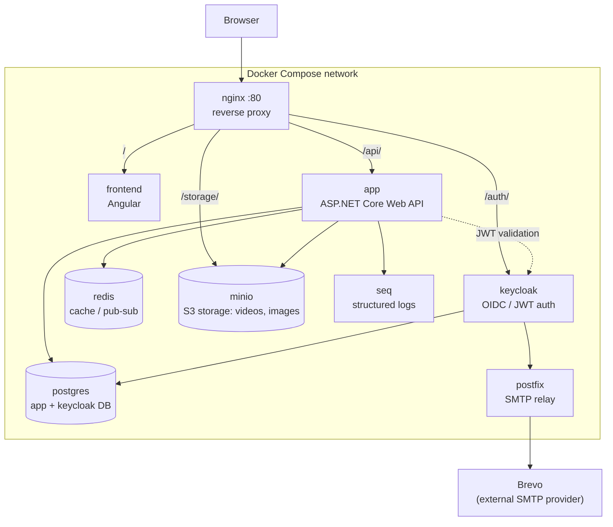

*Magyar verzió: [README.md](README.md).*

# Clipo

A video-sharing platform: Angular frontend, ASP.NET Core (.NET 10) backend, Keycloak-based
authentication, MinIO object storage for videos/images, PostgreSQL database, and Redis cache.
The whole stack runs via Docker Compose.

## Architecture



The browser reaches everything through nginx (port 80); the services inside the Compose
network (app, keycloak, minio, postgres, redis) are not directly reachable from outside.

## Tech stack

| Layer | Technology |
|---|---|
| Frontend | Angular ([Clipo.Client](Clipo.Client)) |
| Backend | ASP.NET Core Web API, .NET 10 ([AsyncApi](AsyncApi)) |
| Database | PostgreSQL + Entity Framework Core |
| Cache / pub-sub | Redis |
| Object storage | MinIO (S3-compatible) |
| Auth | Keycloak (OIDC / JWT) |
| Video processing | FFMpegCore |
| Logging | Serilog + Seq |
| E-mail | Postfix relay → Brevo SMTP |
| Reverse proxy | nginx |
| Containerization | Docker Compose |

## Prerequisites

- Docker + Docker Compose
- Git

## Quick start (development)

```bash
git clone <repo-url>
cd AsyncAPI

# Development environment variables (SMTP, Gemini API key, Redis password)
cp env.development.example env.development
nano env.development   # fill in the values

docker compose --env-file env.development up -d --build
```

On first startup, the SQL scripts in `database/` run automatically and create both the
`asyncapi` and the `keycloak` databases.

> If you also want to reach the app from your local network (e.g. from a phone), create a
> `docker-compose.override.yml` file (already gitignored) and override the `app` service's
> `Storage__PublicUrl` / `Keycloak__ValidIssuer` variables with your machine's LAN IP there.

## Available services (dev)

| Service | URL | Notes |
|---|---|---|
| Frontend | http://localhost | Angular app |
| Backend API | http://localhost/api | REST API |
| API docs | http://localhost/api/scalar/v1 | Scalar UI, dev only |
| Keycloak | http://localhost/auth | admin console: `/auth/admin`, default dev user: `admin` / `admin` |
| MinIO console | http://localhost:9001 | default dev user: `minioadmin` / `minioadmin` |
| PostgreSQL | `localhost:5432` | default dev user: `postgres` / `postgres` |
| Seq (logs) | http://localhost:8081 | |

## Production startup

```bash
cp .env.example .env
nano .env   # fill in: DOMAIN, passwords, SMTP, optionally the Gemini API key

docker compose -f docker-compose.prod.yml up -d --build
```

In `docker-compose.prod.yml` every password and the domain come from `.env` — there are no
hardcoded defaults, everything must be filled in for a production deployment.

## Environment variables

| File | When needed | Template |
|---|---|---|
| `.env` | Production startup (`docker-compose.prod.yml`) | [.env.example](.env.example) |
| `env.development` | Development startup (`docker-compose.yml`) | [env.development.example](env.development.example) |

Neither file is committed to git — create and fill in both from their matching `.example`
file. The Gemini API key (`AI__GeminiApiKey`) is optional: leave it empty to disable the
video tag-generation feature.

## Project structure

```
AsyncApi/           .NET backend (Controllers, Services, Data, Models)
Clipo.Client/        Angular frontend
database/            SQL schema and migrations, run automatically on startup
nginx/                reverse proxy configuration (dev + prod)
keycloak-themes/     custom Keycloak login theme
postfix/              SMTP relay configuration
docker-compose.yml            development stack
docker-compose.prod.yml       production stack
```
