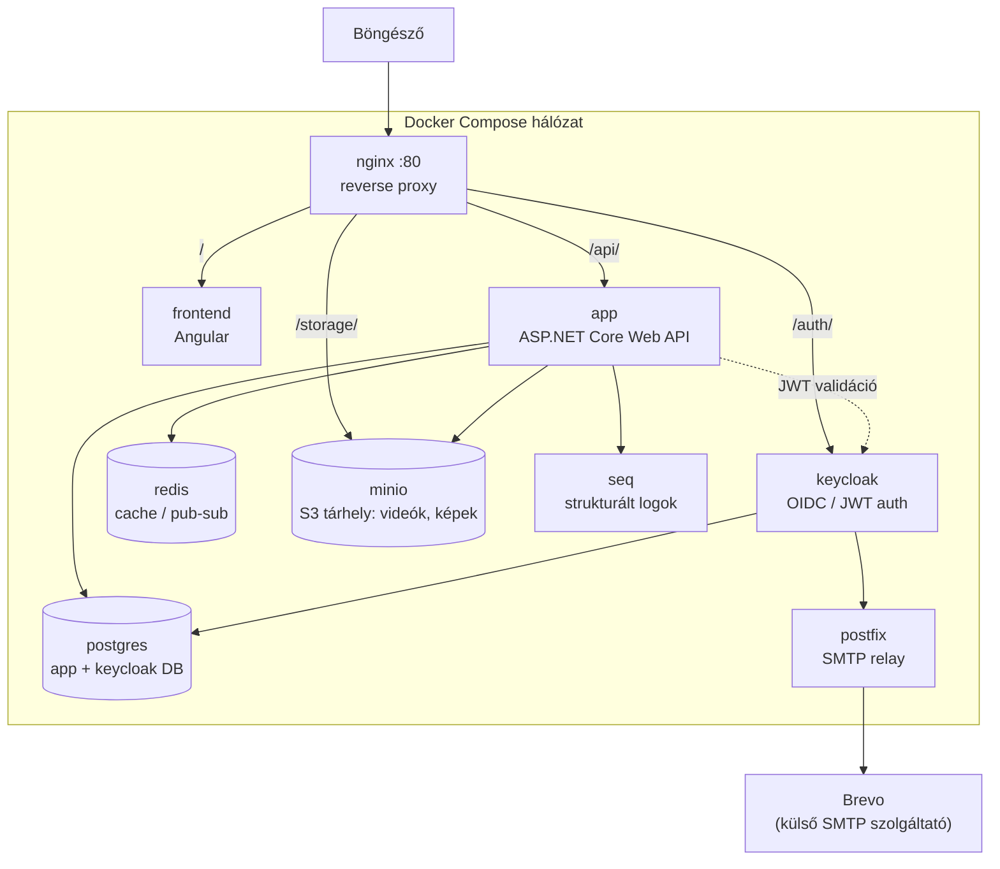

*Read this in [English](README.en.md).*

# Clipo

Videómegosztó platform: Angular frontend, ASP.NET Core (.NET 10) backend, Keycloak alapú
hitelesítés, MinIO objektumtár a videók/képek tárolására, PostgreSQL adatbázis és Redis cache.
A teljes stack Docker Compose-szal indítható.

## Architektúra



A böngésző mindent az nginx-en (80-as port) keresztül ér el; a Compose hálózaton belüli
szolgáltatások (app, keycloak, minio, postgres, redis) kívülről közvetlenül nem elérhetők.

## Tech stack

| Réteg | Technológia |
|---|---|
| Frontend | Angular ([Clipo.Client](Clipo.Client)) |
| Backend | ASP.NET Core Web API, .NET 10 ([AsyncApi](AsyncApi)) |
| Adatbázis | PostgreSQL + Entity Framework Core |
| Cache / pub-sub | Redis |
| Objektumtár | MinIO (S3-kompatibilis) |
| Hitelesítés | Keycloak (OIDC / JWT) |
| Videófeldolgozás | FFMpegCore |
| Logolás | Serilog + Seq |
| E-mail | Postfix relay → Brevo SMTP |
| Reverse proxy | nginx |
| Konténerizáció | Docker Compose |

## Előfeltételek

- Docker + Docker Compose
- Git

## Gyors indítás (fejlesztői környezet)

```bash
git clone <repo-url>
cd AsyncAPI

# Fejlesztői környezeti változók (SMTP, Gemini API kulcs, Redis jelszó)
cp env.development.example env.development
nano env.development   # töltsd ki az értékeket

docker compose --env-file env.development up -d --build
```

Első indításkor a `database/` mappa SQL scriptjei automatikusan lefutnak, és létrejön az
`asyncapi` és a `keycloak` adatbázis is.

> Ha saját helyi hálózatról (pl. telefonról) is el akarod érni a szolgáltatást, hozz létre egy
> `docker-compose.override.yml` fájlt (ez gitignore-olva van), és abban írd felül az `app`
> szolgáltatás `Storage__PublicUrl` / `Keycloak__ValidIssuer` változóit a géped LAN IP-jére.

## Elérhető szolgáltatások (dev)

| Szolgáltatás | URL | Megjegyzés |
|---|---|---|
| Frontend | http://localhost | Angular alkalmazás |
| Backend API | http://localhost/api | REST API |
| API dokumentáció | http://localhost/api/scalar/v1 | Scalar UI, csak dev módban |
| Keycloak | http://localhost/auth | admin konzol: `/auth/admin`, alapértelmezett dev user: `admin` / `admin` |
| MinIO konzol | http://localhost:9001 | alapértelmezett dev user: `minioadmin` / `minioadmin` |
| PostgreSQL | `localhost:5432` | alapértelmezett dev user: `postgres` / `postgres` |
| Seq (logok) | http://localhost:8081 | |

## Éles (production) indítás

```bash
cp .env.example .env
nano .env   # töltsd ki: DOMAIN, jelszavak, SMTP, opcionálisan Gemini API kulcs

docker compose -f docker-compose.prod.yml up -d --build
```

A `docker-compose.prod.yml`-ben minden jelszó és a domain is a `.env` fájlból jön — nincs
hardcode-olt alapérték, éles környezetben minden kötelezően kitöltendő.

## Környezeti változók

| Fájl | Mikor kell | Példa |
|---|---|---|
| `.env` | Éles indításhoz (`docker-compose.prod.yml`) | [.env.example](.env.example) |
| `env.development` | Fejlesztői indításhoz (`docker-compose.yml`) | [env.development.example](env.development.example) |

Egyik fájl sem kerül gitbe — mindkettőt a hozzá tartozó `.example` fájlból kell létrehozni és
kitölteni. A Gemini API kulcs (`AI__GeminiApiKey`) opcionális: üresen hagyva a videó
tag-generálás funkció ki van kapcsolva.

## Projekt struktúra

```
AsyncApi/           .NET backend (Controllers, Services, Data, Models)
Clipo.Client/        Angular frontend
database/            SQL séma és migrációk, induláskor automatikusan lefutnak
nginx/                reverse proxy konfiguráció (dev + prod)
keycloak-themes/     egyedi Keycloak login téma
postfix/              SMTP relay konfiguráció
docker-compose.yml            fejlesztői stack
docker-compose.prod.yml       éles stack
```
